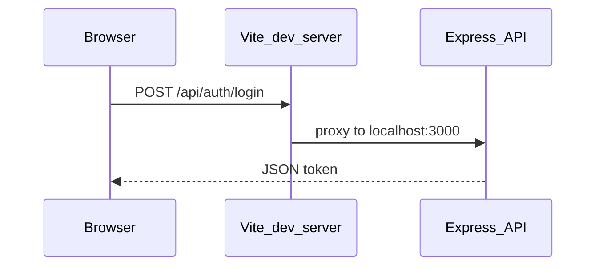
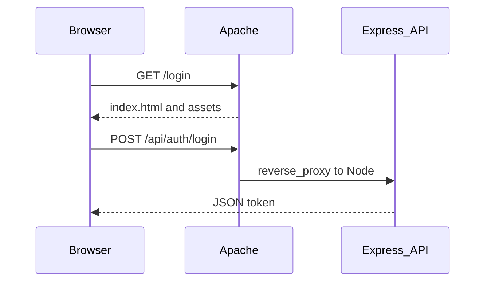

# Retro game–style login frontend

## Current backend (no frontend changes required for core auth)

Your API is already ready in [`server/routes/auth.js`](server/routes/auth.js):

| Action | Method | Body | Success response |
|--------|--------|------|-------------------|
| Sign up | `POST /api/auth/register` | `username`, `email`, `password` | `201` → `{ token, userId, coins }` |
| Log in | `POST /api/auth/login` | `email`, `password` | `200` → `{ token, userId, coins }` |
| Current user | `GET /api/auth/me` | `Authorization: Bearer <token>` | user profile JSON |

The [`client/`](client/) tree is only placeholders ([`client/package.json`](client/package.json) has no React, Vite, or scripts). The old [`client/.env.example`](client/.env.example) uses `REACT_APP_*`; a Vite app should use `VITE_*` instead.

**Development** (Vite proxy):

**Production with Apache** (recommended shape): browser talks only to Apache; Apache serves the built SPA from `client/dist` and forwards `/api/*` to the Node process (same URL shape as dev, so the client can keep using relative `/api` paths).

## 1. Bootstrap the client (Vite + React)

- Add a standard **Vite + React (JavaScript)** setup under `client/`: `vite.config.js`, `index.html`, `src/main.jsx`, `src/App.jsx`.
- Dependencies: `react`, `react-dom`, `react-router-dom`, and dev: `vite`, `@vitejs/plugin-react`.
- **`vite.config.js`**: proxy `/api` → `http://localhost:3000` so the browser calls same-origin `/api/...` in dev and avoids CORS while you use two ports (e.g. Vite `5173`, API `3000`).
- **`client/.env.example`**: Prefer **`VITE_API_BASE_URL` empty** for both dev (Vite proxy) and **Apache production** when Apache reverse-proxies `/api` to Express on the same site origin. Only set a full URL if the API is on a different origin (then you need CORS on the server).
- **`src/api/auth.js`**: small `fetch` helpers that `POST` to `/auth/login` and `/auth/register` with `Content-Type: application/json`, prefixing `import.meta.env.VITE_API_BASE_URL` when non-empty.

## 2. Auth state and routing

- **`src/context/AuthContext.jsx`** (or a thin hook module): hold `token`, `userId`, `coins`; `login`, `register`, `logout`; persist `token` in **`localStorage`** on success (common for SPAs; you can tighten to `sessionStorage` later if you prefer).
- **`react-router-dom`**: routes such as `/login` (auth screen) and `/` or `/home` (minimal placeholder after login, gated by token).
- **Guard**: if no token, redirect to `/login`; optional `useEffect` calling `GET /api/auth/me` on app load to validate token and clear stale JWTs.

## 3. Mario-esque login / sign-up UI (single screen)

- **One route** with a clear toggle: **“Log in”** vs **“Sign up”** (tabs or two big pixel buttons).
  - **Log in**: `email`, `password` → `POST /api/auth/login`.
  - **Sign up**: `username`, `email`, `password` → `POST /api/auth/register`.
- **Visual language** (CSS only, no heavy UI kit):
  - **Font**: e.g. [Press Start 2P](https://fonts.google.com/specimen/Press+Start+2P) via `<link>` in `index.html` (small sizes, generous line-height for readability).
  - **Pixel crispness**: `image-rendering: pixelated` / `crisp-edges` on any decorative assets; chunky borders with stepped `box-shadow` to mimic NES tiles.
  - **Palette**: bright sky blue background, green “ground” band, red/yellow/gold accents, white text with dark outline (`text-shadow`) for readability.
  - **Controls**: large blocky inputs and primary actions; `:focus-visible` outlines; disabled state while `fetch` is in flight.
- **Errors**: map `400` / `401` / `409` JSON `{ error: "..." }` to a visible banner above the form (no stack traces).

## 4. Apache: build and host (production)

This is the deployment path you described: **build the client**, then **Apache** serves it and reaches the API.

1. **Build the client**: `cd client && npm install && npm run build` → static output in **`client/dist/`** (Vite default).
2. **Apache serves static files**: point `DocumentRoot` (or an `Alias`) at `client/dist` (or copy/sync `dist` to your web tree). Ensure directory permissions allow Apache to read files.
3. **SPA routing**: React Router URLs like `/login` must not 404 on refresh. Use **`FallbackResource /index.html`** (Apache 2.4.16+) inside the `<Directory>` for the dist folder, *or* equivalent `RewriteCond`/`RewriteRule` so non-file requests serve `index.html`. Order matters: **do not** let the fallback swallow real files under `/assets/`.
4. **Reverse proxy API to Node**: enable `mod_proxy` and `mod_proxy_http` (and often `mod_headers` if you tweak forwarding). Example pattern (adjust socket/host/port to where Express listens):

   - `ProxyPass /api http://127.0.0.1:3000/api`
   - `ProxyPassReverse /api http://127.0.0.1:3000/api`

   That keeps the browser on **same origin** (`https://yourhost/api/...`), matching the plan’s relative `/api` fetches—**no CORS required** for this layout.
5. **Run Node behind Apache**: Express should listen on localhost (or a private port) via **systemd**, **pm2**, or similar so it stays up; Apache only proxies to it.
6. **TLS**: terminate HTTPS on Apache (`mod_ssl`) as usual; no change required to the JWT flow beyond using HTTPS in production.

Optional: add a small **`docs/apache-vhost.example.conf`** (or similar) in the repo with the above directives so you can copy-tune ServerName/paths—only if you want it versioned; otherwise keep the snippet in your server runbook.

## 5. Express: CORS (when you need it)

There is **no `cors` middleware** today in [`server/index.js`](server/index.js). With **Vite dev proxy** and with **Apache proxying `/api` on the same host**, the browser never cross-origin calls the API, so CORS is unnecessary. Add `cors` + env allowlist only if you **split** the app and API onto different origins (e.g. API on another subdomain without a proxy).

## 6. How you run it locally

1. Terminal A: from `server/`, `npm start` (Oracle + `.env` as today).
2. Terminal B: from `client/`, `npm run dev` (Vite).
3. Open the Vite URL, use **Sign up** then **Log in** (or the reverse) and confirm redirect to the post-auth placeholder and that `localStorage` holds the JWT.

## Files to add or replace (summary)

| Area | Files |
|------|--------|
| Client scaffold | `client/package.json`, `client/vite.config.js`, `client/index.html`, `client/src/main.jsx`, `client/src/App.jsx` |
| Auth + API | `client/src/api/auth.js`, `client/src/context/AuthContext.jsx` |
| UI | `client/src/pages/LoginPage.jsx`, `client/src/pages/HomePage.jsx` (stub), `client/src/styles/retro.css` (or CSS module) |
| Server (optional) | [`server/index.js`](server/index.js) + `server/package.json` — `cors` only if API is on a different origin than the SPA |
| Apache / ops | vhost: `DocumentRoot` → `dist`, `FallbackResource`, `ProxyPass` `/api` → Node; process manager for Node |

No database or auth route contract changes are required; the UI only consumes what already exists.
